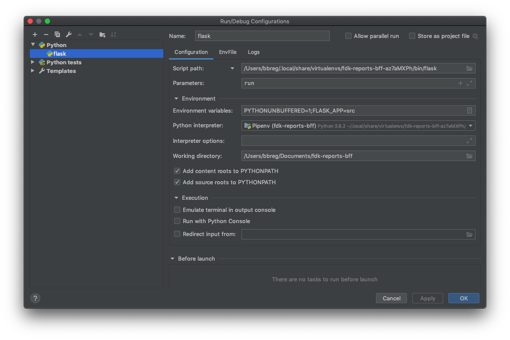

# fdk-reports-bff

## Developing
### Setup
```
% pip install pipenv    # package management tool
% pip install invoke    # a task execution tool & library
% pip install pytest    # test framework
% pipenv install --dev  # install packages from Pipfile including dev
```

### Running the application 
#### in commandline 

```
% docker-comopose up -d                             # start mockserver and elasticsearch
% pipenv shell                                      # open a session in the virtual environment
% FLASK_APP=src FLASK_ENV=development flask run     # run application
```

#### in pycharm
1. Get location of the project's virtual environment
    1. run `pipenv shell` in commandline
    2. copy the file path output located in the third line of output from the command 
    3. Remove last path fragment `/activate`
2. Pycharm configuration
    1. Run -> Edit configuration
    2. Choose Python template
    3. Template values:
        * Name: run flask
        * Script path: <file_path_to_virual_envrionment>/flask
        * Parameters: run
        * Environment variables: PYTHONBUFFERED=1;FLASK_APP=src
    4. Press OK
    5. Choose "run flask" in the drop down menu located in the upper left corner
    6. Start elaticsearch and mock server : `% docker-comopose up -d`
    7. Run application



### *Note*
*The first time you run the application, it might take some time before the port is available due to an
of data in elasticsearch*    

###Task automation
A number of repeating tasks are automated for convenience using [Invoke](http://www.pyinvoke.org/). (See section "Invoke tasks" for more info)


## Testing
### Running tests
```
% invoke unit-test
options:
--install: install pip-dependencies, used by github actions
```
```
% invoke contract-test 
options:
--build: build image for testing before run
--compose: start docker compose for testing before run
--image: name of the image that should be tested. Defaults to digdir/reports-bff:latest
```

### Invoke tasks
```
% invoke unit-test
options:
--install: install pip-dependencies, used by github actions
```
```
% invoke contract-test 
options:
--build: build image for testing before run
--compose: start docker compose for testing before run
--image: name of the image that should be tested. Defaults to digdir/fulltext-search:latest
```

```
build-image                 # build docker image
options:
--tags                      # commaseperated list of tags for image        
```

```
start-docker        #start all containers used in contracttests (useful for debugging errors in contract-tests)
options:
--attach                      #show container logs
```

```
stop-docker        #shut down containers used in contracttests
options:
--clean                      #remove associated containers and networks
--remove                     #remove associated containers, networks and images   
```

## Troubleshooting
### Mac: unknown locale: UTF-8 in Python
`open ~/.bash_profile:`

```
export LC_ALL=en_US.UTF-8
export LANG=en_US.UTF-8
```
restart terminal

### FetchServiceException when updating data
 1. Check if mock server is running:  `GET /http://localhost:8080/organizations`  
 2. If no response restart containers

### ConnectionError etc when updating data
1. Check if elasticsearch is running and avaiable `GET http://localhost:9200/`
2. If no response restart containers

### ElasticSearch: no indexed data

`To manually update data, post request:`

```
http://localhost:8000/updates?ignore_previous=true
```